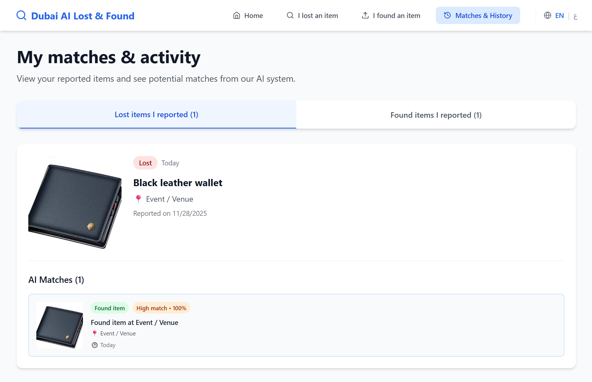
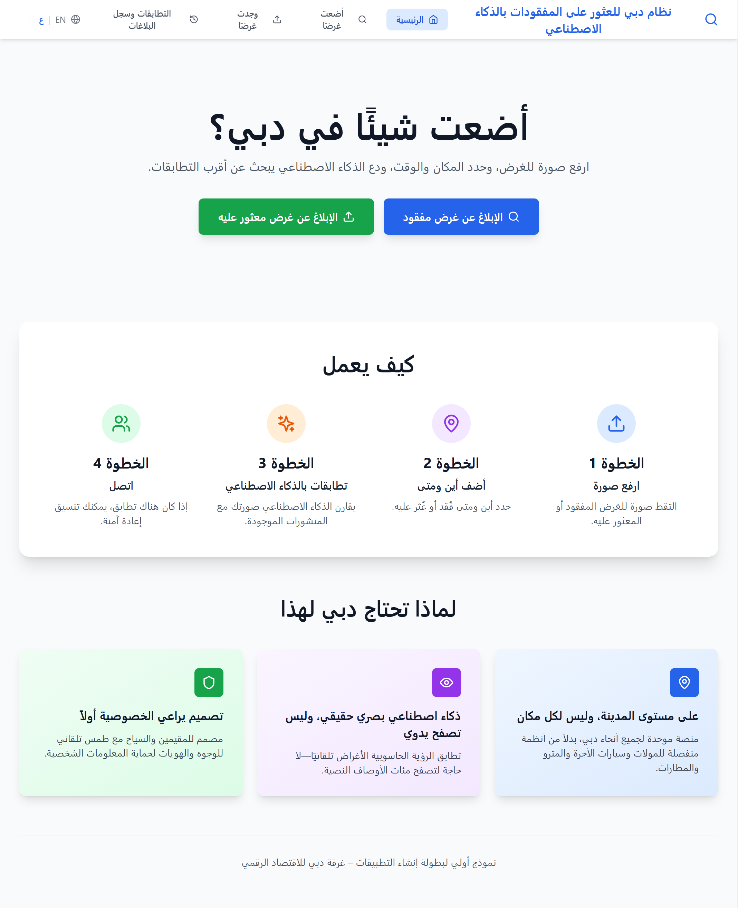
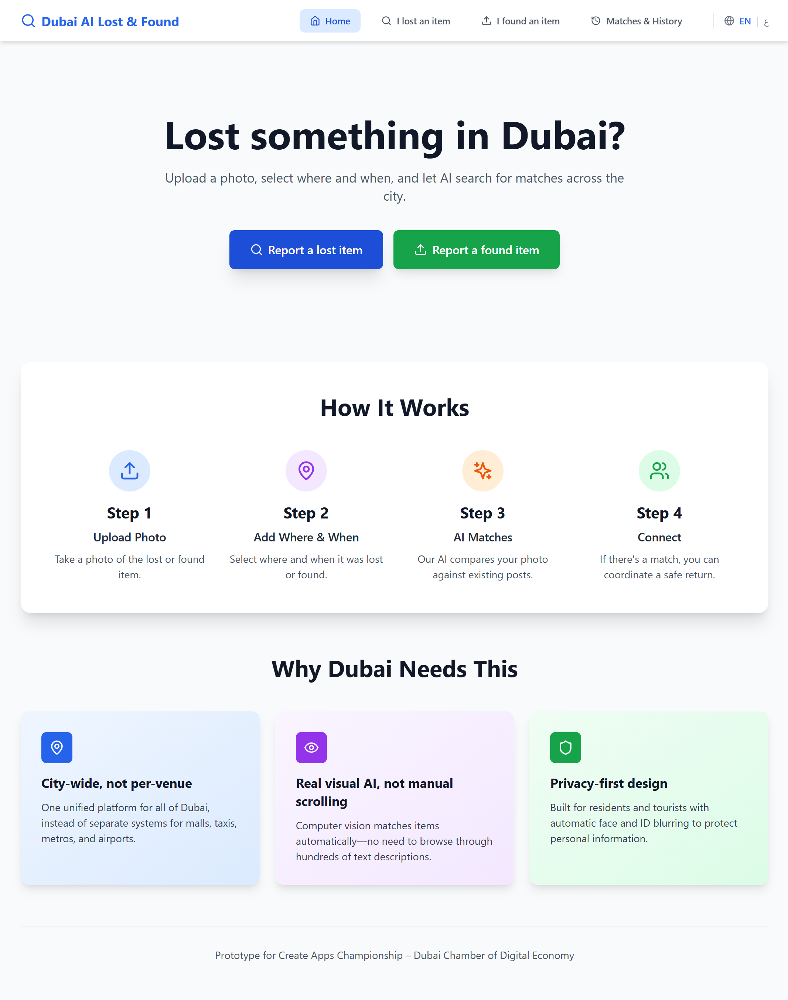
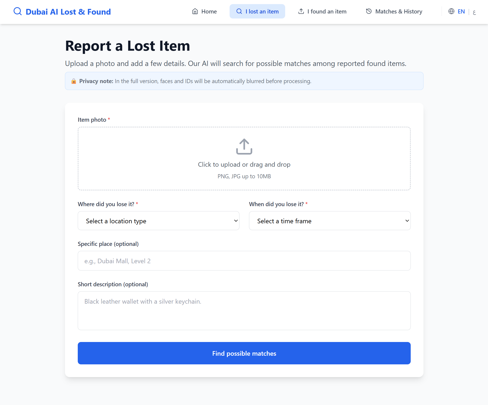
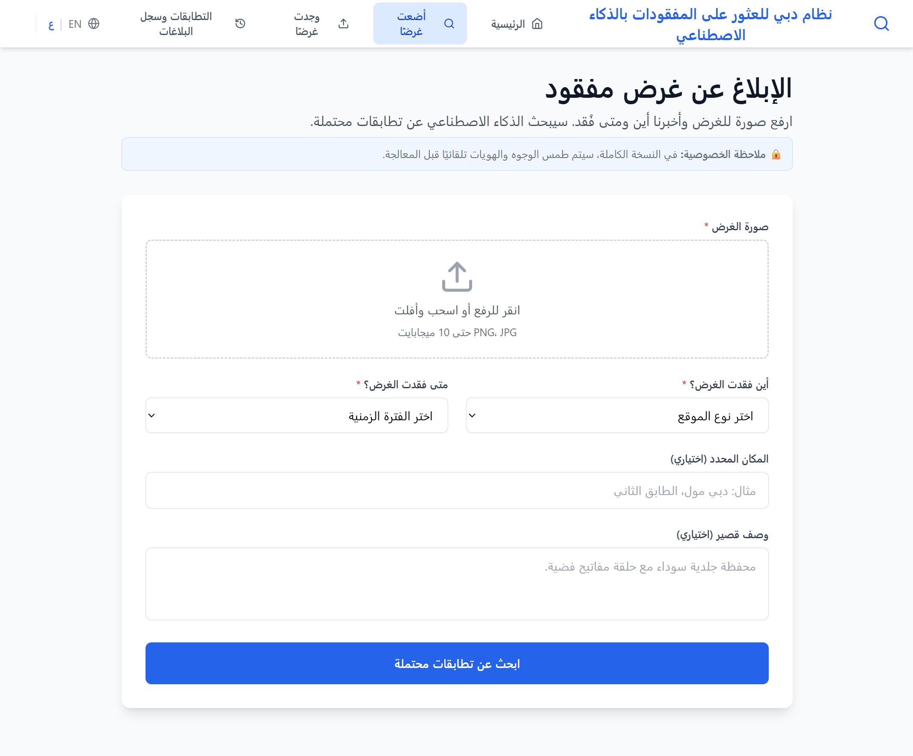
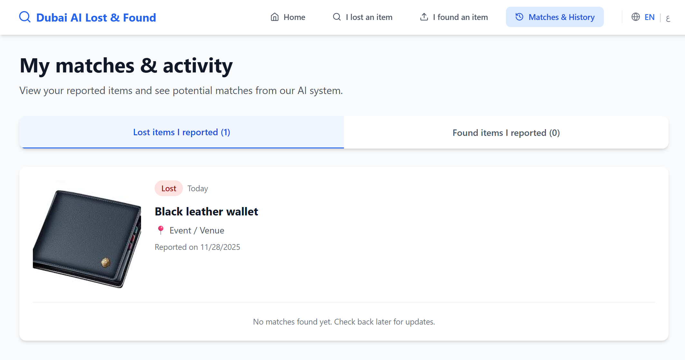
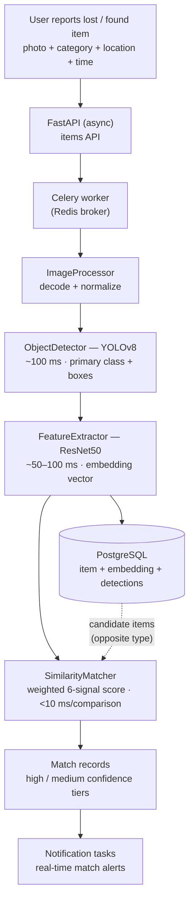

# Mafqood (مفقود) 🔍

**Snap a photo of a lost or found item — multi-signal visual AI matches it across Dubai in a 200–300 ms pipeline.**

Mafqood is an AI-powered lost & found platform built for the
**Create Apps Championship 2025 – Dubai Chamber of Digital Economy**: a photo-first
alternative to Dubai's fragmented lost-and-found desks, with full Arabic (RTL)
and English support.

**Live demo:** [mafqood.albaraaalolabi.dev](https://mafqood.albaraaalolabi.dev)


-success)

<table>
  <tr>
    <td></td>
    <td></td>
  </tr>
  <tr>
    <td align="center"><i>AI matching in action</i></td>
    <td align="center"><i>Arabic (RTL) interface</i></td>
  </tr>
</table>

<details>
<summary><b>More screenshots (EN/AR reporting flow, history)</b></summary>
<table>
  <tr>
    <td></td>
    <td></td>
  </tr>
  <tr>
    <td></td>
    <td></td>
  </tr>
</table>
</details>

---

## Key Results

| Metric | Value |
|---|---|
| End-to-end AI pipeline (detect → embed → match) | **~200–300 ms** per item |
| YOLOv8 object detection | **~100 ms** per image |
| ResNet50 feature extraction | **~50–100 ms** per image |
| Similarity comparison (FAISS / pgvector stack) | **< 10 ms** per comparison at DB scale |
| Match thresholds | final score ≥ 0.25 · high confidence ≥ 0.70 |
| Languages | English + Arabic (full RTL) |

**Multi-signal weighted matching** (production-tuned weights in
[`similarity_matcher.py`](mobile/backend/app/services/ai/similarity_matcher.py)):

| Signal | Weight | Why |
|---|---|---|
| Visual similarity (ResNet50 embeddings) | **65%** | The same item looks similar — strongest signal |
| Category | **15%** | Helps, but AI can misclassify |
| Color | **8%** | Useful, but lighting varies |
| Geolocation | **7%** | Matters, but people travel |
| Temporal | **3%** | Items are often found weeks later |
| Brand | **2%** | Frequently unknown |

---

## Architecture

The production (mobile) backend runs the full matching pipeline asynchronously:



Two deployments share the same idea at different scales:

| | `/mobile` (production) | `/web` (live showcase) |
|---|---|---|
| Frontend | React Native + Expo 54, TypeScript, NativeWind | React + TypeScript + Vite + Tailwind |
| Backend | FastAPI (async) + PostgreSQL + Alembic | FastAPI + SQLite |
| AI | YOLOv8 + ResNet50 + weighted 6-signal matcher | ResNet18 embeddings + cosine similarity |
| Infra | Redis, Celery, Docker, Nginx | Vercel (frontend) + Railway (backend) |

Deeper docs: [`mobile/BACKEND_ARCHITECTURE.md`](mobile/BACKEND_ARCHITECTURE.md) ·
[`mobile/AI_INTEGRATION_SUMMARY.md`](mobile/AI_INTEGRATION_SUMMARY.md) ·
[`web/README.md`](web/README.md)

---

## Quick Start

### Mobile app (production stack)

```bash
cd mobile

# Backend (FastAPI + PostgreSQL)
cd backend
pip install -r requirements.txt
python main.py

# App (Expo)
cd ..
npm install
npx expo start
```

A `docker-compose.yml` for the backend stack (API, PostgreSQL, Redis, Celery)
lives in [`mobile/backend/`](mobile/backend/).

### Web platform (showcase)

```bash
# Frontend
cd web/frontend
npm install
npm run dev

# Backend
cd ../backend
pip install -r requirements.txt
uvicorn app.main:app --reload
```

Or run both locally with [`start-web-local.ps1`](start-web-local.ps1).

---

## Tech Stack & Links

| Layer | Technologies |
|---|---|
| Mobile | React Native · Expo 54 · TypeScript · NativeWind · EN/AR i18n (RTL) |
| API | FastAPI (async) · SQLAlchemy · Alembic · JWT auth |
| AI / CV | PyTorch · YOLOv8 (detection) · ResNet50 (embeddings) · FAISS · pgvector |
| Async & realtime | Redis · Celery (image processing, matching, notification tasks) · WebSocket-based alert design |
| Data | PostgreSQL (production) · SQLite (web demo) |
| Deploy | Docker + Nginx (backend) · Vercel + Railway (web showcase) |

- 🌐 **Live demo:** [mafqood.albaraaalolabi.dev](https://mafqood.albaraaalolabi.dev)
- 📱 Mobile app details: [`mobile/README.md`](mobile/README.md)
- 🧠 AI pipeline notes: [`mobile/AI_INTEGRATION_SUMMARY.md`](mobile/AI_INTEGRATION_SUMMARY.md)
- 🌍 Web showcase: [`web/README.md`](web/README.md)

## License

MIT — see [`mobile/LICENSE`](mobile/LICENSE) and [`web/LICENSE`](web/LICENSE).
